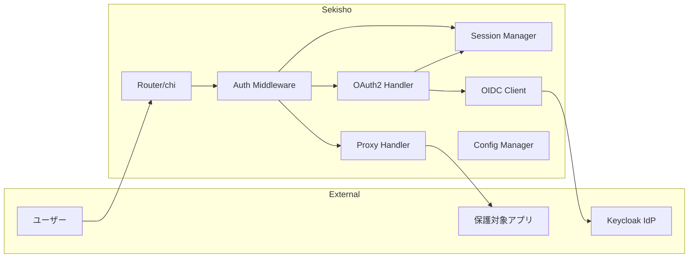
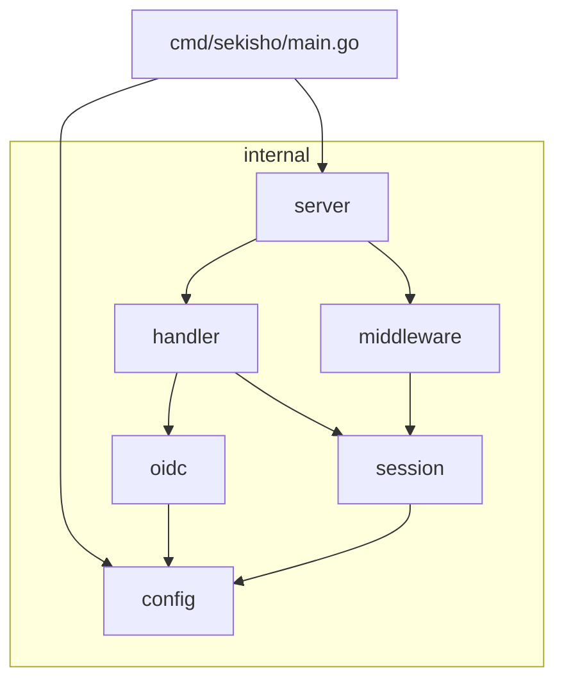
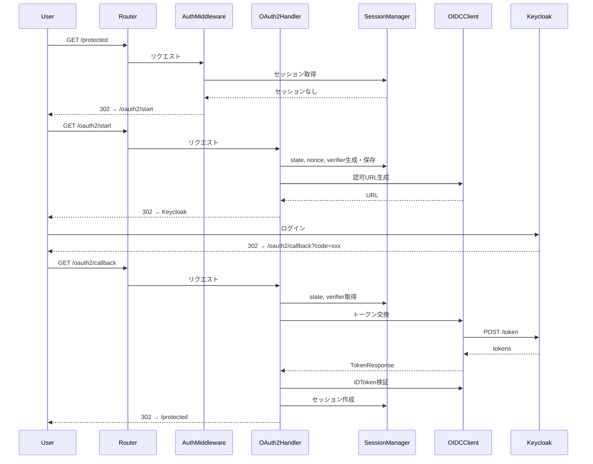
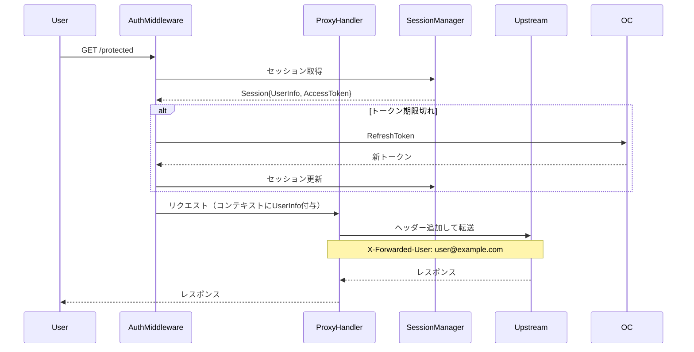

# Sekisho アーキテクチャ設計書

## 1. システムアーキテクチャ概要



---

## 2. パッケージ構造

```
sekisho/
├── cmd/
│   └── sekisho/
│       └── main.go              # エントリーポイント
├── internal/
│   ├── config/
│   │   ├── config.go            # 設定構造体・読み込み
│   │   └── config_test.go
│   ├── handler/
│   │   ├── oauth2.go            # OAuth2エンドポイント
│   │   ├── proxy.go             # リバースプロキシ
│   │   ├── health.go            # ヘルスチェック
│   │   └── handler_test.go
│   ├── middleware/
│   │   ├── auth.go              # 認証ミドルウェア
│   │   ├── logging.go           # ログミドルウェア
│   │   └── middleware_test.go
│   ├── session/
│   │   ├── session.go           # セッション管理
│   │   ├── cookie.go            # Cookie操作
│   │   └── session_test.go
│   ├── oidc/
│   │   ├── client.go            # OIDCクライアント
│   │   ├── token.go             # トークン検証
│   │   ├── pkce.go              # PKCE実装
│   │   └── oidc_test.go
│   └── server/
│       ├── server.go            # HTTPサーバー
│       └── router.go            # ルーティング設定
├── docker/
│   ├── docker-compose.yml       # 開発環境
│   └── keycloak/
│       └── realm-export.json    # Realm設定
├── config.yaml                  # 設定ファイル例
├── Makefile
├── go.mod
└── go.sum
```

---

## 3. コンポーネント設計

### 3.1 コンポーネント一覧

| コンポーネント | パッケージ | 責務 |
|----------------|------------|------|
| **Config** | `internal/config` | 設定ファイル・環境変数の読み込み |
| **Server** | `internal/server` | HTTPサーバーのライフサイクル管理 |
| **Router** | `internal/server` | ルーティング設定（chi） |
| **AuthMiddleware** | `internal/middleware` | 認証状態の確認・リダイレクト |
| **OAuth2Handler** | `internal/handler` | OAuth2フロー処理 |
| **ProxyHandler** | `internal/handler` | リバースプロキシ処理 |
| **SessionManager** | `internal/session` | セッションのCRUD操作 |
| **OIDCClient** | `internal/oidc` | IdPとの通信・トークン操作 |

### 3.2 コンポーネント詳細

#### Config（設定管理）

```go
type Config struct {
    Server  ServerConfig
    OAuth2  OAuth2Config
    Session SessionConfig
}

type ServerConfig struct {
    ListenAddress string
    UpstreamURL   string
}

type OAuth2Config struct {
    IssuerURL     string
    ClientID      string
    ClientSecret  string
    RedirectURL   string
    Scopes        []string
}

type SessionConfig struct {
    CookieName    string
    CookieSecret  string
    CookieExpire  time.Duration
    CookieSecure  bool
    CookieHTTPOnly bool
}
```

#### SessionManager（セッション管理）

```go
type Session struct {
    ID           string
    AccessToken  string
    RefreshToken string
    IDToken      string
    ExpiresAt    time.Time
    UserInfo     UserInfo
    CSRFToken    string    // stateパラメータ用
    PKCEVerifier string    // PKCE code_verifier
    Nonce        string    // OIDC nonce
}

type UserInfo struct {
    Subject   string
    Email     string
    Name      string
}
```

#### OIDCClient（OIDC通信）

```go
type OIDCClient interface {
    // 認可URLを生成
    GetAuthorizationURL(state, nonce, codeVerifier string) string
    
    // 認可コードをトークンに交換
    ExchangeCode(ctx context.Context, code, codeVerifier string) (*TokenResponse, error)
    
    // IDトークンを検証
    VerifyIDToken(ctx context.Context, idToken, nonce string) (*IDTokenClaims, error)
    
    // トークンをリフレッシュ
    RefreshToken(ctx context.Context, refreshToken string) (*TokenResponse, error)
}
```

---

## 4. 依存関係図



**依存ルール:**
- `cmd/` → `internal/` のみ参照可能
- `internal/` 内は横方向の依存を最小化
- `config` は他パッケージから参照される（設定値の注入）

---

## 5. データフロー

### 5.1 認証フロー（未認証ユーザー）



### 5.2 プロキシフロー（認証済みユーザー）



---

## 6. セキュリティ設計

### 6.1 PKCE実装

```go
// code_verifier: 43〜128文字のランダム文字列
func generateCodeVerifier() string {
    b := make([]byte, 32)
    rand.Read(b)
    return base64.RawURLEncoding.EncodeToString(b)
}

// code_challenge: SHA256(code_verifier) のBase64URL
func generateCodeChallenge(verifier string) string {
    h := sha256.Sum256([]byte(verifier))
    return base64.RawURLEncoding.EncodeToString(h[:])
}
```

### 6.2 セッションCookie暗号化

**暗号化方式: AES-CFB (Cipher Feedback)**

> **選定理由**: AES-GCMではIV（Initialization Vector）の再利用が致命的な脆弱性となるため、
> クライアントサイドCookieでの使用にはAES-CFBがより安全。oauth2-proxyでも同様の方式を採用。

**鍵導出: HKDF-SHA256**

```go
import (
    "crypto/sha256"
    "golang.org/x/crypto/hkdf"
    "io"
)

// CookieSecretから暗号化鍵を導出
func deriveKey(secret []byte, info string) ([]byte, error) {
    hkdf := hkdf.New(sha256.New, secret, nil, []byte(info))
    key := make([]byte, 32)  // AES-256
    if _, err := io.ReadFull(hkdf, key); err != nil {
        return nil, err
    }
    return key, nil
}

// 用途別の鍵導出
// - 暗号化鍵: deriveKey(secret, "cookie-encryption")
// - 署名鍵:   deriveKey(secret, "cookie-signing")
```

**セッションデータ格納**
- セッションデータはサーバーサイドで保持せず、Cookie内に暗号化して格納
- Cookie サイズ上限（4KB）を考慮し、必要最小限のデータのみ格納

### 6.3 セキュリティチェックリスト

#### OAuth2/CSRF対策

| 対策 | 実装箇所 | 説明 |
|------|----------|------|
| CSRF（state） | `OAuth2Handler.Start` | 認可リクエストとコールバックの紐付け |
| PKCE | `OAuth2Handler.Start/Callback` | 認可コード横取り攻撃の防止 |
| Open Redirect防止 | `OAuth2Handler.Callback` | リダイレクトURLのホワイトリスト検証 |

#### IDトークン検証（OIDC準拠）

| 検証項目 | 実装箇所 | 説明 |
|----------|----------|------|
| **署名検証** | `OIDCClient.VerifyIDToken` | JWKS公開鍵によるRS256署名検証 |
| **alg検証** | `OIDCClient.VerifyIDToken` | 許可されたアルゴリズムのみ受け入れ（RS256） |
| **iss検証** | `OIDCClient.VerifyIDToken` | 発行者がDiscoveryのissuerと一致することを確認 |
| **aud検証** | `OIDCClient.VerifyIDToken` | client_idが含まれることを確認 |
| **exp検証** | `OIDCClient.VerifyIDToken` | 有効期限切れでないことを確認（クロックスキュー許容：60秒） |
| **iat検証** | `OIDCClient.VerifyIDToken` | 発行時刻が妥当な範囲内であることを確認 |
| **nonce検証** | `OIDCClient.VerifyIDToken` | リプレイ攻撃防止、セッションに保存した値と一致確認 |

#### Cookie セキュリティ

| 対策 | 実装箇所 | 説明 |
|------|----------|------|
| Secure属性 | `SessionManager.SetCookie` | HTTPS接続でのみ送信 |
| HttpOnly属性 | `SessionManager.SetCookie` | JavaScriptからのアクセス防止 |
| SameSite=Lax | `SessionManager.SetCookie` | クロスサイトリクエストでの送信制限 |
| AES-CFB暗号化 | `SessionManager.Encrypt` | セッションデータの機密性保護 |

---

## 7. エラーハンドリング方針

| エラー種別 | HTTPステータス | 処理 |
|-----------|---------------|------|
| セッション無効 | 302 | `/oauth2/start`へリダイレクト |
| state不一致 | 400 | エラーページ表示 |
| トークン交換失敗 | 500 | エラーログ + エラーページ |
| IDToken検証失敗 | 401 | 認証やり直し |
| Upstream接続失敗 | 502 | Bad Gateway |
