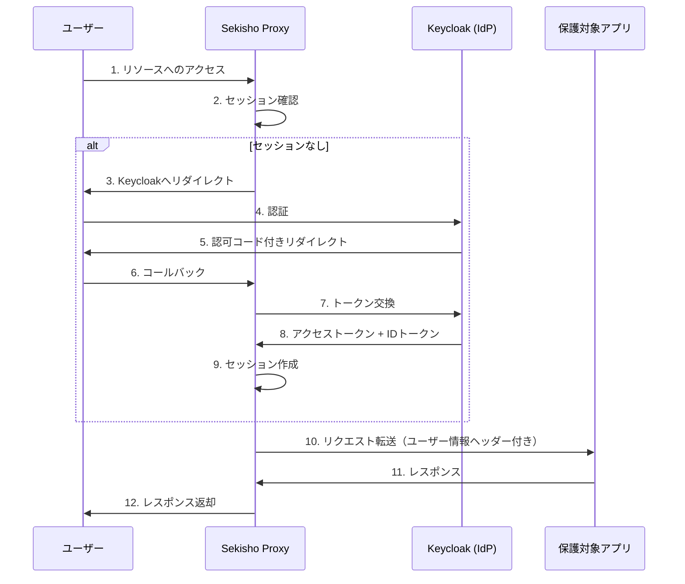

# OAuth2Proxy 要件定義書（MVP）

## 1. システム概要

### 1.1 システム名
Sekisho（関所）OAuth2 Proxy

### 1.2 システムの目的
Webアプリケーションの前段に配置され、OAuth2/OIDC認証を代行するリバースプロキシを実装する。

### 1.3 システム構成図



---

## 2. 機能要件（MVP）

### 2.1 認証機能

| ID | 要件 |
|----|------|
| AUTH-01 | OAuth 2.0 Authorization Code Flowに対応すること |
| AUTH-02 | OpenID Connect (OIDC) ID Tokenを検証すること |
| AUTH-03 | Keycloakと連携できること |
| AUTH-04 | PKCE (Proof Key for Code Exchange) を実装すること |
| AUTH-05 | OIDC nonceパラメータを検証すること（リプレイ攻撃対策） |
| AUTH-06 | ID Tokenのaud（Audience）クレームを検証すること |
| AUTH-07 | Access Tokenの有効期限を検証し、必要に応じてRefresh Tokenで更新すること |
| AUTH-08 | ID Tokenのiss（Issuer）クレームがDiscoveryのissuerと一致することを検証すること |
| AUTH-09 | ID Tokenのexp（Expiration）クレームを検証すること（クロックスキュー許容: 60秒） |
| AUTH-10 | ID Tokenのiat（Issued At）クレームが妥当な範囲内であることを検証すること |
| AUTH-11 | ID Tokenの署名をJWKS公開鍵で検証すること |
| AUTH-12 | ID Tokenのalgヘッダーが許可されたアルゴリズム（RS256）であることを検証すること |

### 2.2 セッション管理機能

| ID | 要件 |
|----|------|
| SESSION-01 | Cookieベースのセッション管理を行うこと |
| SESSION-02 | セッションの有効期限を設定できること |
| SESSION-03 | セッション情報をAES-CFBで暗号化すること |
| SESSION-04 | Cookie暗号化鍵をHKDF-SHA256で導出すること |

### 2.3 プロキシ機能

| ID | 要件 |
|----|------|
| PROXY-01 | 認証済みリクエストを上流サーバーに転送すること |
| PROXY-02 | ユーザー情報をHTTPヘッダー（X-Forwarded-User等）に付与すること |
| PROXY-03 | 未認証リクエストをIdPにリダイレクトすること |

### 2.4 設定機能

| ID | 要件 |
|----|------|
| CONFIG-01 | 環境変数から設定を読み込むこと |
| CONFIG-02 | 設定ファイル（YAML）から設定を読み込むこと |

### 2.5 基本機能

| ID | 要件 |
|----|------|
| BASIC-01 | ログアウト機能を提供すること |
| BASIC-02 | ヘルスチェックエンドポイント（/health）を提供すること |

### 2.6 エラーハンドリング機能

| ID | 要件 |
|----|------|
| ERROR-01 | エラー発生時は適切なHTTPステータスコードを返却すること |
| ERROR-02 | APIエラーレスポンスはRFC 6749（OAuth 2.0）のエラー形式に準拠すること（JSON） |
| ERROR-03 | ユーザー向けエラーページを表示する場合、技術的な詳細（スタックトレース等）を表示しないこと |
| ERROR-04 | サーバーサイドでエラー詳細をログ出力すること |

---

## 3. 非機能要件（MVP）

### 3.1 セキュリティ

| ID | 要件 |
|----|------|
| SEC-01 | CSRF対策（stateパラメータ）を実装すること |
| SEC-02 | Secure/HttpOnly Cookieを使用すること |
| SEC-03 | シークレット情報を環境変数で管理すること |
| SEC-04 | リダイレクトURL（Open Redirect）の検証を行うこと |

### 3.2 運用

| ID | 要件 |
|----|------|
| OPS-01 | 構造化ログ（JSON）を出力すること |
| OPS-02 | Graceful Shutdownに対応すること |
| PERF-01 | プロキシ処理のオーバーヘッドは50ms以内を目標とすること |

---

## 4. エンドポイント設計

| エンドポイント | メソッド | 説明 |
|---------------|----------|------|
| `/oauth2/start` | GET | OAuth2認証フロー開始 |
| `/oauth2/callback` | GET | Keycloakからのコールバック |
| `/oauth2/sign_out` | GET/POST | ログアウト |
| `/health` | GET | ヘルスチェック |
| `/*` | ANY | リバースプロキシ（認証必須） |

---

## 5. 設定項目

```yaml
# config.yaml
server:
  listen_address: ":4180"
  upstream_url: "http://localhost:8080"

oauth2:
  issuer_url: "http://localhost:8180/realms/sekisho"
  client_id: "${OAUTH2_CLIENT_ID}"
  client_secret: "${OAUTH2_CLIENT_SECRET}"
  redirect_url: "http://localhost:4180/oauth2/callback"
  scopes:
    - openid
    - email
    - profile

session:
  cookie_name: "_sekisho"
  cookie_secret: "${SESSION_SECRET}"
  cookie_expire: "24h"
  cookie_secure: false  # ローカル開発用
  cookie_http_only: true
```

---

## 6. 用語集

| 用語 | 説明 |
|------|------|
| OAuth 2.0 | 認可フレームワーク（RFC 6749） |
| OIDC | OpenID Connect、OAuth 2.0上の認証レイヤー |
| Keycloak | オープンソースのIdP |
| Authorization Code | 認可コード、トークン取得に使用 |
| Access Token | リソースアクセス用トークン |
| ID Token | ユーザー情報を含むJWT |
| state | CSRF対策用のランダム値 |
| PKCE | 認可コード横取り攻撃を防ぐ拡張仕様 (RFC 7636) |
| code_challenge | PKCEで送信するハッシュ値 |
| code_verifier | PKCEで使用する検証用文字列 |
| nonce | リプレイ攻撃対策用のランダム値 (OIDC) |
| aud | Audience、トークンの利用者を識別する値 |
| Refresh Token | 有効期限切れのAccess Tokenを更新するためのトークン |
