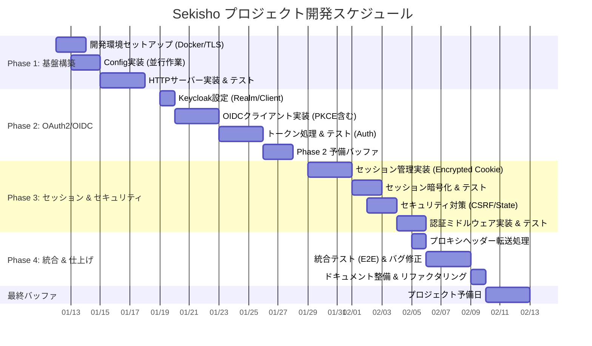

# Sekisho プロジェクトスケジュール

## 前提条件 (Assumptions)
- **稼働想定**: 週5日稼働 + 必要に応じて週末バッファ使用 (1日8時間想定)
- **並行作業**: Phase 1の環境構築と設定実装は部分的に並行して進める
- **リスク管理**: Phase 2 (認証) には技術的不確実性が高いため、専用のバッファを設ける

## マイルストーン
- **2026-01-18**: 基盤機能完了（HTTPサーバー起動、プロキシ動作確認）
- **2026-01-28**: 認証フロー疎通（ログイン→トークン取得まで、バッファ込み）
- **2026-02-04**: セキュアなセッション管理完了（暗号化Cookie、CSRF対策）
- **2026-02-10**: MVP機能完成（全機能統合、テストパス）
